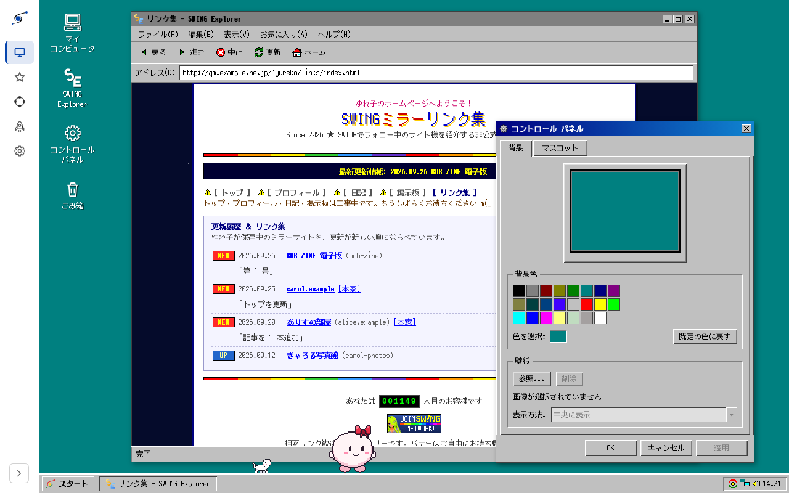

<p align="center">
  <picture>
    <source media="(prefers-color-scheme: dark)" srcset="docs/assets/swing-lockup-dark.svg">
    
  </picture>
</p>

<p align="center">
  
  <br>
  <sub>Desktop 画面（<a href="docker/demo/README.md">デモ環境</a>のサンプルデータ）</sub>
</p>

# SWING

SWING (Static-site Webring by IPFS and Nostr Generator) は、個人サイトの運営者同士が、互いのサイトを自発的に保存・配送し合うための相互ミラーツールです。

「誰のサイトを保存するか」を Nostr で表明し、実際のデータの保存と配送は IPFS で行います。中央の保存サーバーや管理者は存在しません。あなたのサイトを保存するかどうかは、それぞれの参加者が自分の意思で決めます。逆に言うと、SWING はデータの永久保存を保証するものではありません。保存してくれる参加者がいる間だけ、あなたのサイトのコピーが IPFS 上に残ります。

SWING が提供するのは、この「誰を保存するか」の表明と、実際に保存・配送するための最小限の仕組みだけです。今のところ、Web UI やアカウント登録、決済、専用の Relay や IPFS ネットワークは提供していません。

詳しい設計思想を知りたい方は [`docs/plan.md`](docs/plan.md) を、現在の実装の詳細な仕様を知りたい方は [`docs/architecture.md`](docs/architecture.md) をご覧ください。

## しくみ

```text
                 Nostr
        ┌─────────┼─────────┐
        │         │         │
      Alice      Bob      Carol
        │         │         │
   mirror-agent mirror-agent mirror-agent
        │         │         │
      Kubo      Kubo      Kubo
        │         │         │
        └─────────┼─────────┘
             Public IPFS
```

Nostr は「更新の通知」と「誰のサイトを保存するか」を伝えるために使います。IPFS はサイトの実データを保存・配送するために使います。

各参加者は `mirror-agent`（このツールの `swing up` が動かす agent）と、IPFS ノードである Kubo を動かします。mirror-agent は自分が保存すると決めた相手のサイト更新を Nostr 経由で受け取り、ポリシーに沿って CID を Kubo の MFS（Kubo 内のファイルシステム）に置いて保存します。

## 必要なもの

次のどちらかで動かせます。

- **バイナリで動かす場合**: `swing` バイナリと、IPFS ノードである Kubo のバイナリ（`ipfs`、v0.43.1）。今のところ配布物は用意していないので、`swing` は自分でビルド（Rust 1.97 で `cargo build --release`）し、Kubo は[公式の配布ページ](https://dist.ipfs.tech/kubo/v0.43.1/)から取得します。`ipfs` は `swing` と同じディレクトリに置くか PATH に通しておけば、`swing up` が自動で見つけます
- **Docker Compose で動かす場合**: Docker と Docker Compose（`docker compose` コマンドが使えること）

どちらの場合も、次が必要です。

- Nostr の秘密鍵（nsec または hex 形式）。サイト保存・ミラー参加専用の鍵を新しく作ることをおすすめします。作り方はいくつかあります。
  - `swing key generate`（バイナリを直接使う場合。設定ファイルが無くても動きます）
  - `docker compose run --rm mirror key generate`（Docker Compose を使う場合。`.env` が無くても動きます）
  - `nak key generate`（[nak](https://github.com/fiatjaf/nak) の CLI。出力は hex の秘密鍵なので、そのまま `SWING_NOSTR_SECRET_KEY` に入れられます。`nak key public <hex>` で公開鍵を得られます）
  - Nostr クライアントで新規アカウントを作り、設定画面から nsec を書き出す（例: Damus、Amethyst、noStrudel、Nostur）
- 自分のサイトも公開したい場合は、そのビルド済み静的サイトのディレクトリ（例: `./public`）。あわせて、ルートを自分で管理しているドメインがあると NIP-05 で本人確認ができます（必須ではありません）

## はじめかた（ミラー参加者として）

まずリポジトリを取得します。

```bash
git clone <このリポジトリ>
cd swing
```

### バイナリで動かす

`swing` バイナリをビルドします（Rust 1.97 が必要です。ビルド済みバイナリの配布は今のところありません。[`docs/todo.md`](docs/todo.md) を参照してください）。

```bash
cargo build --release
```

`target/release/swing`（Windows は `swing.exe`）ができます。あわせて Kubo v0.43.1 を[公式の配布ページ](https://dist.ipfs.tech/kubo/v0.43.1/)から取得し、中の `ipfs`（Windows は `ipfs.exe`）を `swing` と同じディレクトリに置くか、PATH に通してください。

秘密鍵を生成します。

```bash
./target/release/swing key generate
```

設定ファイルを用意します。

```bash
cp swing.example.toml swing.toml
```

`swing.toml` を開き、少なくとも次を書き換えてください。

- `[nostr] secret_key`: 生成した鍵の nsec または hex
- `[nostr] relays`: 実際に使う Nostr relay
- `[policy] max_total_storage`: 保存する全サイト合計の容量上限

既定では `[kubo] managed = true` になっていて、`swing up` 自身が Kubo を子プロセスとして初期化・起動します。状態ファイルは `[agent] state_dir`（既定 `./data`）に、Kubo のリポジトリはその下の `kubo`（既定 `./data/kubo`）に置かれます。他の設定項目は後述の「設定一覧」を参照してください。

起動します。

```bash
./target/release/swing up
```

Kubo を初期化・起動し、その上で mirror-agent を動かします。ダッシュボードは `http://127.0.0.1:8082/`、Kubo のゲートウェイは `http://127.0.0.1:8080/` で待ち受けます。Kubo の RPC はループバックのランダムなポートで待ち受けるため外部からは触れず、公開する必要があるのは IPFS swarm 用のポート（`4001/tcp`・`4001/udp`）だけです（詳しくは「プライバシーと注意点」）。`swing up` を実行している間は、`swing mirror add` や `swing sites` などの他のサブコマンドも同じ設定ファイルを指定するだけで、管理下の Kubo を自動で見つけて使えます。

ログイン時に自動で起動させたい場合は、OS のサービスとして登録します。

```bash
./target/release/swing service install
```

Linux では systemd のユーザーユニット、macOS では launchd の LaunchAgent、Windows ではタスクスケジューラに登録します（Linux はログアウト後も動かし続けるために `loginctl enable-linger` を試み、失敗すれば案内を表示します）。状態確認は `swing service status`、停止は `swing service stop`、削除は `swing service uninstall` です。詳しくは [`docs/architecture/up.md`](docs/architecture/up.md) と [`docs/architecture/service.md`](docs/architecture/service.md) を参照してください。

### Docker Compose で動かす

`.env` ファイルを作り、必要な項目を設定します。

```bash
cp .env.example .env
```

`SWING_NOSTR_SECRET_KEY` を埋めるには、次のように鍵を生成するのが手軽です。

```bash
docker compose run --rm mirror key generate
```

`.env.example` に含まれる項目は次のとおりです。

| 変数 | 意味 |
| --- | --- |
| `SWING_NOSTR_SECRET_KEY` | 署名用の秘密鍵（nsec または hex）。空のままでは起動できません |
| `SWING_NOSTR_RELAYS` | 接続する Nostr Relay（カンマ区切り）。実際に自分が使っている relay に置き換えることをおすすめします |
| `SWING_MIRROR_SET` | ミラー対象リスト（Follow Set）の `d` タグ。通常は既定値 `swing` のままで構いません |
| `SWING_MAX_TOTAL_STORAGE` | 保存する全サイト合計の容量上限（例: `20GB`） |

最低限、`SWING_NOSTR_SECRET_KEY` は必ず自分の値に書き換えてください。他の環境変数の全体像は「設定一覧」を参照してください。

`.env` を用意できたら、コンテナを起動します。

```bash
docker compose up -d
```

`ipfs`（Kubo）と `mirror`（このツール本体、`swing up` を実行します。Kubo は `ipfs` コンテナ側を使うため `SWING_KUBO_MANAGED=false` を固定で渡しています）の 2 つのコンテナが立ち上がります。外部に公開されるのは IPFS の swarm 用ポート（`4001/tcp`・`4001/udp`）だけです。Kubo の RPC（5001）はホストにも公開されず、ゲートウェイ（8080）はホストの `127.0.0.1:8080` だけに公開されます。

### ミラー対象を管理する・状態を見る

ここから先のコマンド例はバイナリで直接動かしている場合の書き方です。Docker Compose の場合は `swing ...` を `docker compose exec mirror swing ...` に読み替えてください（`up` はコンテナ起動時に自動で実行されるので、`swing up` 自体を読み替える必要はありません）。

保存したい相手を追加するには `swing mirror add` を実行します。相手の npub（または hex、nprofile）を指定してください。

```bash
swing mirror add npub1alice... npub1bob...
```

これは Nostr 上の NIP-51 Follow Set（`kind 30000`, `d = swing`）を更新し、指定した相手を保存対象として宣言します。設定を確認するには次のようにします。

```bash
swing mirror list
```

保存対象のサイトの状態を見るには `swing sites` を使います。

```bash
swing sites
```

各サイトについて `d`（サイト識別子）、`cid`、`url`、`size`、`created_at`、NIP-05 の検証結果、最新版のレプリカ数、保存状況（`stored` / `not stored`）が 1 行ずつ表示されます。作者が更新メモを付けていれば、次の行に `message:` として表示されます。mirror-agent は最後に確認したミラー対象リストを状態ファイルに保存しています。relay が古いリストを返したり、リストを失ったりしても、保存済みの新しいリストを使い、relay に送り直します。そのため、relay の不調でミラー対象から外れたと誤認してサイトを消すことはありません。ミラーをやめたい相手は `swing mirror remove` で外してください。

ミラー対象から外したのにまだ保存しているサイトは、最後に `[unfollowed]` として表示されます。これを消すには `remove_on_unfollow` を `true` にして mirror-agent を再起動してください。次の Follow Set の確認で消えます。

保存したサイトが Kubo 上で壊れていないかは `swing status` で確認できます。

```bash
swing status
```

状態ファイルに記録した版が Kubo の MFS に揃っているかと、状態ファイルに無い余分なパスを表示します。問題があれば 0 以外で終了するので、cron などからの監視にも使えます。詳しくは [`docs/architecture/cli.md`](docs/architecture/cli.md#status) を参照してください。

保存したサイトはローカルのゲートウェイで閲覧できます。`http://localhost:8080/ipfs/<cid>/` を開くと `http://<cid>.ipfs.localhost:8080/` に移り、サイトごとに別のオリジンで表示されます。ゲートウェイはローカルにあるデータだけを返し、ネットワークから取りに行きません。

動作状況は、直接 `swing up` を実行していればそのまま端末（または `--log-file` で指定したファイル）に出ます。サービスとして登録した場合は、Linux なら `journalctl --user -u swing -f`、macOS なら `~/Library/Logs/swing.log`、Windows ならサービス登録時のログファイルで確認できます。Docker Compose の場合はコンテナのログで確認します。

```bash
docker compose logs -f mirror
```

## ダッシュボード

SWING は mirror-agent（バイナリでは `swing up`、Docker Compose では `mirror` コンテナ）がブラウザ向けの管理画面も兼ねています。起動したら、バイナリでも Docker Compose でも同じ URL `http://127.0.0.1:8082/` を開いてください。

- **Desktop**: 保存中のサイトを、懐かしい Windows 風デスクトップ上のブラウザウィンドウに表示される「リンク集」ページ風に眺められます。
- **Sites**: `swing sites` と同じ内容を一覧表示し、そのまま「mirror に追加」「mirror から外す」を操作できます。ボタンひとつで `swing status` 相当のストレージチェックも実行できます。
- **Webring**: `swing webring` のグラフを、ドラッグ・パン・ズームできる図として表示します。ノードを選ぶとレプリカ数の詳細が見られ、そこから mirror への追加もできます。
- **Publish**: これまでに公開したサイトの一覧（「My sites」）から選び直したり、新しく publish したりできます。ブラウザから直接フォルダを選んでアップロードする方式なので、**Docker Compose でも volume のマウントは不要**です（既定の上限は 2GB、`SWING_DASHBOARD_MAX_UPLOAD` で変更可）。
- **Settings**: 現在の設定を読み取り専用で表示します（秘密鍵の値は一切表示されません）。ブラウザ側のテーマ・表示言語（日本語/English）・カスタム CSS もここで設定します。

ダッシュボードは既定で `127.0.0.1` だけで待ち受け、認証はありません（信頼できる利用者だけがアクセスできる前提です）。`swing status`・`swing mirror add`・`swing mirror remove`・`swing stop` はこのダッシュボードの API を経由します。ホストでの公開先を変えたい場合や、Web の管理画面だけを外して API だけ残したい場合は `.env` に次のように設定してください。

```bash
# ホストでの公開先を変える（既定は 127.0.0.1:8082）
SWING_DASHBOARD_BIND=0.0.0.0:8082
# Web の管理画面だけを配信しない（Docker Compose でも直接バイナリを動かす場合でも共通。/api/* は残る）
SWING_DASHBOARD_UI=false
```

見た目は `--swing-*` の CSS 変数と `SWING_DASHBOARD_CUSTOM_CSS`（`/custom.css` として配信される追加スタイルシート）でカスタマイズできます。Desktop 画面のリンク集ページは、`SWING_DASHBOARD_DESKTOP_PAGE`（ページ本体の HTML）・`SWING_DASHBOARD_DESKTOP_PAGE_CSS`（そのページ専用の CSS）・`SWING_DASHBOARD_DESKTOP_BANNER`（88×31 バナー画像）で丸ごと自分のものに差し替えられます（いずれも起動時に読み込みます）。このページは同一オリジンの iframe に入っているので、ダッシュボードのスタイルは一切当たらず、こちらのスタイルも外に漏れません。ページに `desk-link-list` などの決まった `id` を置いておくと、そこにリンク一覧が描画されます（詳しくは [`docs/architecture/dashboard/web.md`](docs/architecture/dashboard/web.md)）。API の詳しい仕様やガード（Host 検証、CSRF 対策など）は [`docs/architecture/dashboard.md`](docs/architecture/dashboard.md) を参照してください。

## 自分のサイトを公開する

自分の静的サイトを SWING に乗せて公開するには、`swing publish` を使います。

SWING の publish は、サイト識別子 `d` に自分のドメイン名を使い、そのドメインのルート（`https://<ドメイン>/`）を自分で管理していることを前提にしています。NIP-05 の検証はそのドメインの `/.well-known/nostr.json` を見に行くためです。サイトをサブパス以下で配信している場合や、共有ホスティングでドメインのルートを管理していない場合は、次のいずれかで対応してください。

1. `--site` にドメイン以外の識別子（例: `example-com-myname`）を指定する。この場合 NIP-05 は「対象外」となり、`warn` モードならそのまま publish できます
2. `--nip05 off` を指定して NIP-05 検証自体を行わない

`d` の値は、ミラーする側や今後の webring 一覧がそのサイトの名前として表示するものになるので、一度決めたら変えずに使い続けることをおすすめします。

Docker Compose で動かしている場合は、サイトのディレクトリをコンテナにマウントして実行します。

```bash
docker compose run --rm -v "$PWD/public:/site" mirror publish --site example.jp --url https://example.jp/ /site
```

バイナリで動かしている場合は、`swing up` を動かしたまま同じ設定ファイルで次のように実行します（`swing up` が管理する Kubo を自動で見つけます）。

```bash
swing publish --site example.jp --url https://example.jp/ ./public
```

`--site` はサイト識別子（`d` タグ）で必須です。`--url` はサイトを HTTP で配信している場合の URL で、省略できます。省略すると、IPFS だけで公開するサイトとして publish します（例: `swing publish --site my-notes ./public`）。`--title` でサイトの表示用タイトルを付けられます。作者の自己申告であり、受信側はこれを検証や保存判断には使いません。`-m`（`--message`）で「ブログに記事を追加」のような更新メモを付けられます。メモはサイトイベントの本文になり、ミラーする側の `swing sites` や、SWING に対応していない Nostr クライアントにも表示されます。実行すると、次のような出力になります。

```text
Site: example.jp
URL: https://example.jp/

NIP-05
  ✓ verified

IPFS
  CID: bafy...
  ✓ added to /swing/publish/<pubkey>/example.jp/1700000000
  Size: 12345 bytes

Nostr
  ✓ wss://relay.damus.io
  ✓ wss://nos.lol

Old versions (keeping 5)
  ✓ removed /swing/publish/<pubkey>/example.jp/1690000000

Published.
```

処理内容は、ディレクトリを Kubo に追加して MFS の `/swing/publish/` の下に置き、その root CID を含むサイトイベント（`kind 35980`）に自分の鍵で署名し、設定した全 relay に publish する、というものです。どれかの relay に受理されたら、同じサイトの古い版を新しい順に `keep_versions`（既定 5）個だけ残して MFS から消します。

NIP-05 は、`d` タグがドメイン名の形をしている場合に、そのドメインの所有者が自分の pubkey を掲載しているかどうかを確認する任意の検証です。確認するには、公開するドメインの `https://{ドメイン}/.well-known/nostr.json` に `{"names": {"_": "<自分の pubkey の hex>"}}` を置きます。検証モードは `--nip05 off|warn|require`（省略時は `.env` の `SWING_PUBLISH_NIP05`、既定 `warn`）で切り替えられ、`warn` は結果を表示するだけで publish を続行し、`require` は検証に成功しない限り publish を中止します。

### 何人が保存しているかを見る

mirror-agent は、保存している版の CID を「レプリカ報告」（`kind 35981`）として Nostr に出し続けます。自分で publish したサイトも、同じ Kubo（同じ `SWING_MFS_ROOT`）で mirror-agent を動かしていれば、作者本人の分として報告されます。`swing replicas` で、自分のサイトを誰が保存しているかを確認できます。

```bash
docker compose exec mirror swing replicas
```

```text
npub1me... (<pubkey>)
  d=example.jp cid=bafy... replicas=2 (reports=3)
    npub1alice...  [latest]  [chosen]
    npub1me...     [latest]  [author]
    npub1bob...    [older version]  [unverified]
```

`replicas` は、最新版を持っていると報告した参加者のうち、作者本人（`[author]`）か、作者またはあなたのミラー対象リストに載っている人（`[chosen]`）の数です。それ以外の報告者（`[unverified]`。誰でも自称できるため信頼度が低い扱い）が最新版を持っていれば、`replicas=2 (+3 unverified)` のように別枠で添えます（0 件なら省略）。`[older version]` は古い版だけを持っている参加者です。報告は自己申告なので、実際に配送できるかまでは保証しません。npub などを渡すと、他の人のサイトについても表示します。

### 相互ミラーの関係（Webring）を見る

`swing webring` は、自分を起点にミラー対象リストをたどり、誰が誰を保存しているかをグラフとして表示します。たどるのは自分が実際に保存対象へ入れている相手（`p` タグ）だけで、自分をミラー対象に入れているだけの相手（`#p` で見つかる、フォローし返されていない相手）はグラフには加えず、「Referencing the root」に自称にすぎない一覧として別枠で出します。

```bash
docker compose exec mirror swing webring
```

```text
Webring of mirror set "swing" (depth 2): 4 accounts, 1 mutual, 2 one-way

Accounts
  example.jp             npub1me...     depth=0  [root]
  alice.example          npub1alice...  depth=1
  npub1bob12…xyz789      npub1bob...    depth=1
  carol.example          npub1carol...  depth=2

Mutual
  example.jp ↔ alice.example

One-way (A → B: A mirrors B)
  alice.example → carol.example
  npub1bob12…xyz789 → example.jp

Referencing the root (unverified)
  npub1dave...
```

各アカウントは公開しているサイトの `d` で表示し、サイトが無ければ npub を縮めて表示します。`--depth <N>`（既定 2）でたどる距離を、npub などを渡すと起点を変えられます。`--format dot` で Graphviz、`--format mermaid` で Mermaid の図として出力します。

```bash
docker compose exec mirror swing webring --format dot | dot -Tsvg > webring.svg
```

## 自分のサイトをゲートウェイで配信する

決めたホスト名だけを DNSLink で配信する HTTP サーバーは、SWING 自身に内蔵しています。TLS は扱わないので、Cloudflare Tunnel などを前段に置いて、そこから転送してください。

バイナリで動かす場合は `swing.toml` に次を書いて `swing up`（サービス登録している場合は再起動）します。

```toml
[gateway]
listen = "127.0.0.1:8081"
hosts = ["example.com", "blog.example.net"]
```

Docker Compose で動かす場合は `.env` に次を書いて `docker compose up -d` します。

```bash
SWING_GATEWAY_LISTEN=0.0.0.0:8081
SWING_GATEWAY_HOSTS=example.com,blog.example.net
```

コンテナ内では `0.0.0.0:8081` で listen させ、ホストへの公開先は別途 `SWING_GATEWAY_BIND`（既定 `127.0.0.1:8081`）で決めます。

各ホストの DNS に `_dnslink.<ホスト名>` の TXT レコード（`dnslink=/ipfs/<cid>`）を置きます。ゲートウェイは Kubo のゲートウェイにそのまま中継するだけで、ローカルにあるデータしか返しません。CID は `swing publish` でこのノードに置いたものにしてください。publish のたびに TXT レコードも更新します。

設定したホスト名以外、および `/ipfs/<cid>` のようなパスでのアクセスには 404 を返します。詳しくは [`docs/architecture/gateway.md`](docs/architecture/gateway.md) を参照してください。

## どれくらい保存されるか

あなたのサイトを保存してくれる各参加者は、以下のようなポリシーに沿って保存量・保存期間を制限しています。値は参加者ごとのローカル設定であり、SWING の既定値は次のとおりです。

| キー | 既定値 | 意味 |
| --- | --- | --- |
| `max_total_storage` | `100GB` | 保存する全サイト合計の容量上限 |
| `max_per_site` | `10GB` | 1 サイトあたりの容量上限。超えた分は古い版から削除される |
| `max_per_account` | `20GB` | 1 アカウント（pubkey）が持つ全サイトの合計容量上限。超える更新は保存されない |
| `max_sites_per_account` | `10` | 1 アカウントあたりに保存するサイト数の上限。既に保存しているサイトの更新は続く |
| `max_update_size` | `2GB` | 1 回の更新（1 バージョン）あたりのサイズ上限。超えると保存されない |
| `keep_versions` | `5` | サイトごとに保持する旧バージョンの数。超えた分は古い順に削除される |
| `keep_days` | `365` | バージョンを保持する日数。最新版を除き、これより古い版は削除される |
| `min_update_interval` | `1h` | 同じサイトを取り込む最短間隔（実時間）。前回保存してからこれが経つまでは新しい版を受け付けない。見送った版も、経過後の poll で最新版が改めて評価されるので、最新の内容には追いつく |
| `remove_on_unfollow` | `true` | 相手をミラー対象から外したときに、自動でそのサイトの保存をやめるかどうか。`false` なら最後に保存した版を残し続ける |
| `nip05` | `warn` | 保存前に行う NIP-05 検証のモード（`off` / `warn` / `require`） |
| `nip05_cache_ttl` | `1d` | NIP-05 の検証結果を再利用する期間 |

サイズはイベントの `size` タグではなく、実際に取得したデータ量で判定します。取得中に上限（`max_update_size`・`max_per_site`・`max_per_account` の最小値）を超えた時点で取得を打ち切ります。

打ち切った取得や削除した版のデータは、Kubo の GC が走るまでディスクに残ります。Kubo は `--enable-gc` で起動し、GC の基準になる `Datastore.StorageMax` を起動のたびに設定します。バイナリで `swing up` が管理する Kubo では `[kubo].storage_max`（`SWING_KUBO_STORAGE_MAX`。未設定なら `[policy].max_total_storage` と同じ値）を、Docker Compose の `ipfs` コンテナでは `.env` の `SWING_KUBO_STORAGE_MAX`（未設定なら `SWING_MAX_TOTAL_STORAGE`）を使います。GC はこの値の 90% を超えたときに走るので、少し余裕を足した値にしておくことをおすすめします。

SWING は Kubo の pin を使わず、MFS の `/swing`（`SWING_MFS_ROOT` で変更可）の下だけを使います。手動で付けた pin や、MFS の他の場所に置いたものには触れません。一方で、`/swing/agent` の下は SWING が管理する場所なので、手で置いたものは消されます。

MFS に置いたサイトを他のノードから見つけてもらうには、Kubo の `Provide.Strategy` に `mfs` か `all` が含まれている必要があります。バイナリで `swing up` が管理する Kubo では `[kubo].provide_strategy`（`SWING_KUBO_PROVIDE_STRATEGY`、既定 `pinned+mfs`）を、Docker Compose の `ipfs` コンテナでは `.env` の `SWING_KUBO_PROVIDE_STRATEGY`（既定同じ）を、起動のたびに設定します。外部の Kubo を使う場合（`[kubo].managed = false`）は自分で設定してください。

判定の詳しい順序は [`docs/architecture/agent.md`](docs/architecture/agent.md) を参照してください。

## 設定一覧

TOML の設定ファイル（`swing.toml`）を使う場合と、環境変数だけで動かす場合のどちらにも対応しています。環境変数は常に TOML の値を上書きします。設定ファイルの探索順や、容量・時間の書式（`"100GB"` や `"10m"` のような文字列）は [`docs/architecture.md`](docs/architecture.md) を参照してください。設定例は [`swing.example.toml`](swing.example.toml) にあります。

| 環境変数 | 対応する設定 | 説明 |
| --- | --- | --- |
| `SWING_CONFIG` | (CLI `--config`) | 設定ファイルのパス。省略時は `./swing.toml` |
| `SWING_NOSTR_SECRET_KEY` | `nostr.secret_key` | 署名用秘密鍵（nsec または hex） |
| `SWING_NOSTR_RELAYS` | `nostr.relays` | 接続する relay（カンマ区切り） |
| `SWING_MIRROR_SET` | `nostr.mirror_set` | Follow Set の `d` タグ（既定 `swing`） |
| `SWING_SITE_EVENT_KIND` | `nostr.site_event_kind` | サイトイベントの kind（既定 `35980`） |
| `SWING_REPLICA_EVENT_KIND` | `nostr.replica_event_kind` | レプリカ報告の kind（既定 `35981`） |
| `SWING_IPFS_API` | `ipfs.api` | Kubo RPC のエンドポイント。`[kubo].managed = false` のときだけ使う（既定 `http://127.0.0.1:5001`）。`managed = true` のときに指定するとエラー |
| `SWING_MFS_ROOT` | `ipfs.mfs_root` | SWING が使う MFS のディレクトリ（既定 `/swing`） |
| `SWING_MAX_TOTAL_STORAGE` | `policy.max_total_storage` | 全体容量上限 |
| `SWING_MAX_PER_SITE` | `policy.max_per_site` | サイト単位の容量上限 |
| `SWING_MAX_PER_ACCOUNT` | `policy.max_per_account` | アカウント単位の容量上限 |
| `SWING_MAX_SITES_PER_ACCOUNT` | `policy.max_sites_per_account` | アカウント単位のサイト数上限（既定 `10`） |
| `SWING_MAX_UPDATE_SIZE` | `policy.max_update_size` | 1 更新あたりのサイズ上限 |
| `SWING_KEEP_VERSIONS` | `policy.keep_versions` | 保持する旧バージョン数 |
| `SWING_KEEP_DAYS` | `policy.keep_days` | バージョン保持日数 |
| `SWING_MIN_UPDATE_INTERVAL` | `policy.min_update_interval` | 取り込みの最短間隔 |
| `SWING_REMOVE_ON_UNFOLLOW` | `policy.remove_on_unfollow` | unfollow 時にそのサイトを自動で消すか |
| `SWING_NIP05` | `policy.nip05` | mirror-agent の NIP-05 検証モード（既定 `warn`） |
| `SWING_NIP05_CACHE_TTL` | `policy.nip05_cache_ttl` | NIP-05 検証結果のキャッシュ期間（既定 `1d`。`0` で無効） |
| `SWING_STATE_DIR` | `agent.state_dir` | 状態ファイルを置くディレクトリ |
| `SWING_POLL_INTERVAL` | `agent.poll_interval` | Follow Set の再取得間隔 |
| `SWING_CONCURRENCY` | `agent.concurrency` | 同時に取得・保存するサイト数（既定 `4`） |
| `SWING_REPORT_TTL` | `agent.report_ttl` | レプリカ報告の有効期間（既定 `3d`。半分過ぎたら出し直す。`poll_interval` の 2 倍より長くする） |
| `SWING_FETCH_TIMEOUT` | (なし) | 1 サイト分の取得のタイムアウト（既定 15 分） |
| `SWING_FETCH_IDLE_TIMEOUT` | (なし) | 取得中にデータが届かないまま待つ上限（既定 2 分） |
| `SWING_KUBO_MANAGED` | `kubo.managed` | `swing up` が Kubo を子プロセスとして動かすか（既定 `true`）。付属の `compose.yaml` は `false` を固定で渡す |
| `SWING_KUBO_BINARY` | `kubo.binary` | 管理する Kubo の実行ファイルのパス。既定: `swing` と同じディレクトリの `ipfs`（`.exe`）、無ければ PATH |
| `SWING_KUBO_REPO` | `kubo.repo` | 管理する Kubo のリポジトリ（`IPFS_PATH`）。既定は `[agent].state_dir` の下の `kubo` |
| `SWING_KUBO_STORAGE_MAX` | `kubo.storage_max` | Kubo の `Datastore.StorageMax`。既定は `[policy].max_total_storage` と同じ値。Docker Compose の `ipfs` コンテナでも同じ変数名で使う |
| `SWING_KUBO_PROVIDE_STRATEGY` | `kubo.provide_strategy` | Kubo の `Provide.Strategy`（既定 `pinned+mfs`）。Docker Compose の `ipfs` コンテナでも同じ変数名で使う |
| `SWING_KUBO_GATEWAY_LISTEN` | `kubo.gateway_listen` | 管理する Kubo の `Addresses.Gateway`（既定 `127.0.0.1:8080`）。`[kubo].managed = true` のときだけ使う |
| `SWING_KUBO_SWARM_PORT` | `kubo.swarm_port` | 管理する Kubo の swarm ポート。未設定なら Kubo の既定のまま |
| `SWING_KUBO_GATEWAY_BIND` | (なし、compose の `ipfs` コンテナ用) | Kubo のゲートウェイをホストのどこに公開するか（既定 `127.0.0.1:8080`） |
| `SWING_GATEWAY_LISTEN` | `gateway.listen` | SWING 内蔵の DNSLink ゲートウェイの待ち受けアドレス（既定 `off`。無効） |
| `SWING_GATEWAY_HOSTS` | `gateway.hosts` | DNSLink で配信するホスト名（カンマ区切り）。`listen` が `off` 以外なら必須 |
| `SWING_GATEWAY_UPSTREAM` | `gateway.upstream` | 転送先の Kubo ゲートウェイ。既定: managed なら `http://<[kubo].gateway_listen>`、そうでなければ `http://127.0.0.1:8080` |
| `SWING_GATEWAY_BIND` | (なし、compose の `mirror` コンテナ用) | 内蔵ゲートウェイをホストのどこに公開するか（既定 `127.0.0.1:8081`） |
| `SWING_PUBLISH_KEEP_VERSIONS` | `publish.keep_versions` | `swing publish` が自分のノードに残す版の数（既定 `5`） |
| `SWING_PUBLISH_NIP05` | `publish.nip05` | `swing publish` の NIP-05 検証モード（既定 `warn`。CLI の `--nip05` が優先） |
| `SWING_DASHBOARD_LISTEN` | `dashboard.listen` | ダッシュボードの待ち受けアドレス（既定 `127.0.0.1:8082`）。`swing up` が動いている間ずっと待ち受ける。付属の `compose.yaml` ではコンテナ内の既定値として `0.0.0.0:8082` を使うが、`.env` で上書きできる |
| `SWING_DASHBOARD_UI` | `dashboard.ui` | `false` で Web の管理画面（静的ファイル）を配信せず、`/api/*` の制御 API だけ残す（既定 `true`） |
| `SWING_DASHBOARD_ALLOWED_HOSTS` | `dashboard.allowed_hosts` | Host ヘッダで追加で許可するホスト名（ポート抜き、カンマ区切り） |
| `SWING_DASHBOARD_GATEWAY` | `dashboard.gateway` | ダッシュボードから保存済みサイトを開くリンクの IPFS Gateway（既定 `http://localhost:8080`）。環境変数では空文字にできない |
| `SWING_DASHBOARD_CUSTOM_CSS` | `dashboard.custom_css` | ダッシュボードに読み込ませる追加 CSS ファイルのパス |
| `SWING_DASHBOARD_DESKTOP_PAGE` | `dashboard.desktop_page` | Desktop 画面のリンク集ページ（HTML ファイル）のパス。未設定なら同梱のページ |
| `SWING_DASHBOARD_DESKTOP_PAGE_CSS` | `dashboard.desktop_page_css` | そのリンク集ページ専用の CSS ファイルのパス。未設定なら同梱の CSS |
| `SWING_DASHBOARD_DESKTOP_BANNER` | `dashboard.desktop_banner` | リンク集ページの 88×31 バナー画像のパス（`.png` `.gif` `.jpg` `.jpeg` `.webp` `.svg`）。未設定なら同梱の GIF |
| `SWING_DASHBOARD_MAX_UPLOAD` | `dashboard.max_upload` | Publish 画面のフォルダアップロードで受け付けるボディの上限（既定 `2GB`） |
| `SWING_DASHBOARD_BIND` | (なし、compose の mirror 用) | ダッシュボードをホストのどこに公開するか（既定 `127.0.0.1:8082`） |

## プライバシーと注意点

SWING は公開の IPFS Mainnet をそのまま使うため、匿名性は提供しません。他の IPFS peer から、あなたの Peer ID・IP アドレス・提供している CID などの関連を観測される可能性があります。もともと公開 Web サイトを保存することが前提のツールなので、この点は許容した上でご利用ください。

一方で、Kubo の RPC やローカルのゲートウェイ、ダッシュボード（管理 UI）は外部に公開しません。外部に公開する必要があるのは IPFS swarm 用のポート（`4001`）だけです。バイナリで `swing up` が Kubo を管理する場合、RPC はループバックのランダムなポートで待ち受けるため外部から触ることはできません。Docker Compose の構成でも、Kubo の RPC（5001）はホストに公開されず、ゲートウェイ（`8080`）とダッシュボード（`8082`）はどちらも既定で `127.0.0.1` だけで待ち受けます。ダッシュボードには認証が無いため、`SWING_DASHBOARD_BIND`（またはバイナリの `dashboard.listen`）を変えて外部に公開する場合は自己責任で行ってください。内蔵ゲートウェイで外部に配信するのは、設定した `SWING_GATEWAY_HOSTS`（または `gateway.hosts`）のホストの DNSLink だけです。

Nostr の秘密鍵は、Docker Compose で動かす場合は `.env` に、バイナリで `swing.toml` を使う場合は `swing.toml` の `secret_key` に、どちらも平文で保存されます。サイト公開・ミラー参加専用の鍵を新しく作り、他の用途の鍵とは分けて扱うことをおすすめします。`.env` や `swing.toml` を Git にコミットしないよう注意してください。

## 含まれていないもの・今後の予定

以下は現時点では扱いません。既存の Nostr と IPFS にできるだけそのまま乗ることを優先しています。

- 中央管理サーバー / ユーザー登録
- 専用の Web UI
- IPFS Cluster / private swarm / 独自 DHT
- 任意の CID を配信する公開 Gateway（内蔵ゲートウェイは設定したホストの DNSLink だけを配信します）
- レプリカの自動割当
- 高度なアクセス制御
- 決済
- 独自の Nostr Relay
- 配布用のインストーラー・パッケージ（Homebrew tap、install.sh、winget など）。今のところ `cargo build --release` で自分でビルドしてください（詳しくは [`docs/todo.md`](docs/todo.md)）
- Windows と macOS での動作確認。ビルドは通りますが、サービス登録（タスクスケジューラ・launchd）を含めて実機ではまだ確かめていません。確認済みの範囲は [`docs/todo.md`](docs/todo.md) を参照してください

今後の拡張として、private mode（IP アドレスを隠したい参加者向けの別モード）などを検討しています。NIP-46 remote signer への対応も予定にあります。残タスクの一覧は [`docs/todo.md`](docs/todo.md)、新しい kind や `d` タグの命名規約は [`docs/extensions.md`](docs/extensions.md) を参照してください。

## ドキュメント

- [`docs/plan.md`](docs/plan.md): 初期実装計画。設計の背景や原則を説明しています
- [`docs/protocol.md`](docs/protocol.md): 実装非依存のプロトコル定義。他のクライアントやエージェントを実装する方向けです
- [`docs/architecture.md`](docs/architecture.md): 現在の実装の詳細なリファレンス（詳細は [`docs/architecture/`](docs/architecture/) に分割）。バイナリでの起動・supervisor は [`docs/architecture/up.md`](docs/architecture/up.md)、サービス登録は [`docs/architecture/service.md`](docs/architecture/service.md)、内蔵ゲートウェイは [`docs/architecture/gateway.md`](docs/architecture/gateway.md)
- [`docs/extensions.md`](docs/extensions.md): 新しい kind や `d` タグを追加する際の命名規約と予約表
- [`docs/todo.md`](docs/todo.md): 残タスクの一覧
- [`docs/log/`](docs/log/): 実装ログ（何を決め、何を作り、何を検証したかの記録）
- [`docs/examples/publish.sh`](docs/examples/publish.sh): `ipfs` CLI と `nak` だけでプロトコルを再現する参考実装（サポート対象外）

## ライセンス

[MIT License](LICENSE)

ダッシュボードの Desktop 画面は同梱フォント PixelMplus12（[M+ FONT LICENSE](web/fonts/LICENSE-PixelMplus.txt)、Copyright (C) 2002-2013 M+ FONTS PROJECT）を使用しています。
