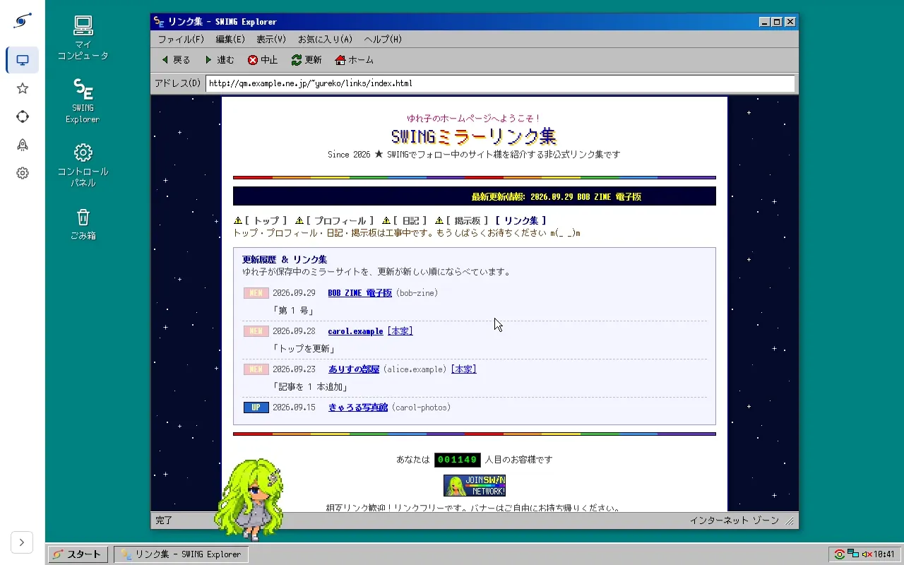

<p align="center">
  <picture>
    <source media="(prefers-color-scheme: dark)" srcset="docs/assets/swing-lockup-dark.svg">
    
  </picture>
</p>

<p align="center">
  <picture>
    <source media="(prefers-reduced-motion: reduce)" srcset="docs/assets/dashboard-desktop.png">
    
  </picture>
  <br>
  <sub>Desktop 画面（<a href="docker/demo/README.md">デモ環境</a>のサンプルデータ）</sub>
</p>

# SWING

SWING (Static-site Webring by IPFS and Nostr Generator) は、個人サイトの運営者同士が、互いのサイトを自発的に保存・配送し合うための相互ミラーツールです。

「誰のサイトを保存するか」を Nostr で表明し、実際のデータの保存と配送は IPFS で行います。中央の保存サーバーや管理者は存在しません。あなたのサイトを保存するかどうかは、それぞれの参加者が自分の意思で決めます。逆に言うと、SWING はデータの永久保存を保証するものではありません。保存してくれる参加者がいる間だけ、あなたのサイトのコピーが IPFS 上に残ります。

SWING が提供するのは、この「誰を保存するか」の表明と、実際に保存・配送するための最小限の仕組みだけです。今のところ、Web UI やアカウント登録、決済、専用の Relay や IPFS ネットワークは提供していません。

詳しい設計思想を知りたい方は [`docs/plan.md`](docs/plan.md) を、現在の実装の詳細な仕様を知りたい方は [`docs/architecture.md`](docs/architecture.md) をご覧ください。

## しくみ

```text
                   Nostr
       +-------------+-------------+
       |             |             |
     Alice          Bob          Carol
       |             |             |
 mirror-agent  mirror-agent  mirror-agent
       |             |             |
     Kubo          Kubo          Kubo
       |             |             |
       +-------------+-------------+
                Public IPFS
```

Nostr は「更新の通知」と「誰のサイトを保存するか」を伝えるために使います。IPFS はサイトの実データを保存・配送するために使います。

各参加者は `mirror-agent`（このツールの `swing up` が動かす agent）と、IPFS ノードである Kubo を動かします。mirror-agent は自分が保存すると決めた相手のサイト更新を Nostr 経由で受け取り、ポリシーに沿って CID を Kubo の MFS（Kubo 内のファイルシステム）に置いて保存します。

## 必要なもの

次のどちらかで動かせます。

- **バイナリで動かす場合**: `swing` バイナリと、IPFS ノードである Kubo のバイナリ（`ipfs`、v0.43.1）。`swing` は GitHub のリリースに Linux・macOS・Windows 向けのビルド済みアーカイブ（Kubo は含みません）があればそれを使い、無ければ自分でビルド（Rust 1.97 で `cargo build --release`）します。Kubo は[公式の配布ページ](https://dist.ipfs.tech/kubo/v0.43.1/)から取得します。`ipfs` は `swing` と同じディレクトリに置くか PATH に通しておけば、`swing up` が自動で見つけます
- **Docker Compose で動かす場合**: Docker と Docker Compose（`docker compose` コマンドが使えること）

常時起動のサーバでも普段使いの PC でも動かせます。使い方・スペック・通信量の目安は「[動かし方の目安](#動かし方の目安)」を参照してください。

どちらの場合も、次が必要です。

- Nostr の秘密鍵（nsec または hex 形式）。サイト保存・ミラー参加専用の鍵を新しく作ることをおすすめします。作り方はいくつかあります。
  - `swing key generate`（バイナリを直接使う場合。設定ファイルが無くても動きます）
  - `docker compose run --rm mirror key generate`（Docker Compose を使う場合。`.env` が無くても動きます）
  - `nak key generate`（[nak](https://github.com/fiatjaf/nak) の CLI。出力は hex の秘密鍵なので、そのまま `SWING_NOSTR_SECRET_KEY` に入れられます。`nak key public <hex>` で公開鍵を得られます）
  - Nostr クライアントで新規アカウントを作り、設定画面から nsec を書き出す（例: Damus、Amethyst、noStrudel、Nostur）
  - 秘密鍵をこのコンピュータに置きたくない場合は、代わりにスマホの署名アプリ（NIP-46）を使えます。セットアップ画面で QR コードを読み取るだけで、秘密鍵は署名アプリから出ません（下記「署名アプリ（NIP-46）で署名する」）
- 自分のサイトも公開したい場合は、そのビルド済み静的サイトのディレクトリ（例: `./public`）。あわせて、ルートを自分で管理しているドメインがあると NIP-05 で本人確認ができます（必須ではありません）

## はじめかた（ミラー参加者として）

まずリポジトリを取得します。

```bash
git clone <このリポジトリ>
cd swing
```

`swing.toml` を用意せずに `swing up` を起動することもできます。設定ファイルが無い（かつ環境変数にも鍵が無い）状態で起動すると、ダッシュボードだけが動く「セットアップモード」になります。ダッシュボードにログインする（下記）とセットアップ画面が表示され、鍵の生成（または既存の鍵の貼り付け、署名アプリとの接続）・relay・保存上限を入力して送信すると `swing.toml` が作られ（バイナリならカレントディレクトリ、Docker Compose ならコンテナの `/data`＝`swing-data` volume）、エージェントはプロセスを終了させずにそのまま通常モードで動き直します。セットアップモードでは、ダッシュボード（8082）や Kubo のゲートウェイ（8080）のポートがほかのプログラムに使われていると、近くの空いているポートにずらして `swing.toml` に書き込みます（ずらしたときはログに出ます。環境変数で指定したポートはずらしません。ずらしたくなければ `swing up --no-port-shift` か環境変数 `SWING_NO_PORT_SHIFT=true`。Docker イメージでは最初から有効で、ずらしません）。以下は設定ファイルを事前に用意して起動する手順で、どちらでも構いません。設定は後からダッシュボードの Settings 画面（環境変数で設定した値を除く）からも変更でき、変更後は再起動すると反映されます。詳しくは [`docs/architecture/dashboard.md`](docs/architecture/dashboard.md) と [`docs/architecture/up.md`](docs/architecture/up.md) を参照してください。

### バイナリで動かす

GitHub のリリースにビルド済みアーカイブがあればそれを展開して使います。無ければ `swing` バイナリをビルドします（Rust 1.97 が必要です）。

```bash
cargo build --release
```

`target/release/swing`（Windows は `swing.exe`）ができます。あわせて Kubo v0.43.1 を[公式の配布ページ](https://dist.ipfs.tech/kubo/v0.43.1/)から取得し、中の `ipfs`（Windows は `ipfs.exe`）を `swing` と同じディレクトリに置くか、PATH に通してください。

秘密鍵を生成します。

```bash
./target/release/swing key generate
```

設定ファイルを用意します。

```bash
cp swing.example.toml swing.toml
```

`swing.toml` を開き、少なくとも次を書き換えてください。

- `[nostr] secret_key`: 生成した鍵の nsec または hex
- `[nostr] relays`: 実際に使う Nostr relay
- `[policy] max_total_storage`: 保存する全サイト合計の容量上限

既定では `[kubo] managed = true` になっていて、`swing up` 自身が Kubo を子プロセスとして初期化・起動します。状態ファイルは `[agent] state_dir`（既定 `./data`。設定ファイルがあれば、相対パスは設定ファイルのあるディレクトリが起点）に、Kubo のリポジトリはその下の `kubo`（既定 `./data/kubo`）に置かれます。他の設定項目は後述の「設定一覧」を参照してください。

起動します。

```bash
./target/release/swing up
```

Kubo を初期化・起動し、その上で mirror-agent を動かします。ダッシュボードは `http://127.0.0.1:8082/`、Kubo のゲートウェイは `http://127.0.0.1:8080/` で待ち受けます。Kubo の RPC はループバックのランダムなポートで待ち受けるため外部からは触れず、公開する必要があるのは IPFS swarm 用のポート（`4001/tcp`・`4001/udp`）だけです（詳しくは「プライバシーと注意点」）。`swing up` を実行している間は、`swing mirror add` や `swing sites` などの他のサブコマンドも同じ設定ファイルを指定するだけで、管理下の Kubo を自動で見つけて使えます。

ログイン時に自動で起動させたい場合は、OS のサービスとして登録します。

```bash
./target/release/swing service install
```

Linux では systemd のユーザーユニット、macOS では launchd の LaunchAgent、Windows ではタスクスケジューラに登録します（Linux はログアウト後も動かし続けるために `loginctl enable-linger` を試み、失敗すれば案内を表示します）。Windows と macOS では、`swing` と同じフォルダに `swing-tray.exe`（macOS は `SWING.app`）があれば、タスクトレイのアイコン（下記「ダッシュボード」）もログイン時に起動するよう登録し、その場で起動します。トレイが要らなければ `--no-tray` を付けてください。Linux で systemd のシステムユニットにしたいときは `sudo swing service install --system` とします。サービスは `sudo` を実行したユーザーの権限で動きます（root では動かしません。別のユーザーで動かすなら `--run-as <user>`）。状態確認は `swing service status`、起動は `swing service start`、停止は `swing service stop`、削除は `swing service uninstall` です。詳しくは [`docs/architecture/up.md`](docs/architecture/up.md) と [`docs/architecture/service.md`](docs/architecture/service.md) を参照してください。

### Docker Compose で動かす

`.env` ファイルを作り、必要な項目を設定します。

```bash
cp .env.example .env
```

`SWING_NOSTR_SECRET_KEY` を埋めるには、次のように鍵を生成するのが手軽です。

```bash
docker compose run --rm mirror key generate
```

`.env.example` は `SWING_NOSTR_SECRET_KEY` 以外すべてコメントアウトされていて、コメントを外さない限りコードの既定値がそのまま使われます（relay や保存上限も含め、既定値のまま起動できます）。行ごとの意味は [`.env.example`](.env.example) 自体のコメントと、[設定一覧](#設定一覧) を参照してください。`SWING_NOSTR_RELAYS` は実際に自分が使う relay に、`SWING_MAX_TOTAL_STORAGE` は保存したい容量に、必要に応じてコメントを外して書き換えてください。最低限、`SWING_NOSTR_SECRET_KEY` は必ず自分の値に書き換えてください（空のままでも起動でき、その場合はダッシュボードのセットアップ画面から鍵を生成・保存できます。上記「はじめかた」を参照）。`.env` に書いた値はダッシュボードから編集できなくなる（[設定一覧](#設定一覧)）ので、コメントを外すのは実際に固定したい項目だけにしてください。

`.env` を用意できたら、コンテナを起動します。

```bash
docker compose up -d
```

`ipfs`（Kubo）と `mirror`（このツール本体、`swing up` を実行します。Kubo は `ipfs` コンテナ側を使うため `SWING_KUBO_MANAGED=false` を固定で渡しています）の 2 つのコンテナが立ち上がります。外部に公開されるのは IPFS の swarm 用ポート（`4001/tcp`・`4001/udp`）だけです。Kubo の RPC（5001）はホストにも公開されず、ゲートウェイ（8080）はホストの `127.0.0.1:8080` だけに公開されます。

`mirror` は既定で手元のソースからイメージをビルドします。リリースごとに公開しているイメージを使う場合は、`compose.yaml` の `mirror` の `build: .` をコメントアウトし、その下の `image: ghcr.io/amane-katagiri/swing` のコメントを外してください（最新のリリースが使われます。バージョンを固定するなら `ghcr.io/amane-katagiri/swing:0.1.0` のように書きます）。

#### Docker Compose からバイナリの `swing up` に移る

compose の 2 つの volume をホストにコピーすれば、同じ Kubo（PeerID・ブロック・MFS）と同じ agent の状態のまま `swing up`（`[kubo] managed = true`）に移れます。`swing-data`（`state.json`・`dashboard.token`・`remote-signer.json`・ダッシュボードで書いた `swing.toml`）を `<dir>/data` に、`ipfs-data`（Kubo の repo）を `<dir>/data/kubo` に置き、`swing.toml` だけ `<dir>` に出します。`<dir>` は `swing.toml` を置くディレクトリで、`[agent] state_dir` と `[kubo] repo` の既定値にそのまま合います。

```sh
docker compose stop                       # volume は消さない
dest=~/swing                              # <dir>。data はまだ作らない（あると data/data に入る）
mkdir -p "$dest"
docker compose cp mirror:/data "$dest/data"
docker compose cp ipfs:/data/ipfs "$dest/data/kubo"
[ -f "$dest/data/swing.toml" ] && mv "$dest/data/swing.toml" "$dest/"
```

Windows（PowerShell）でも `docker compose cp` はそのまま使えます（`$dest` を `"$HOME\swing"` などに、最後の行を `Move-Item` に読み替えてください）。コピーしたファイルはコマンドを実行したユーザーの所有になります。

- `.env` の設定は `<dir>/swing.toml` に移します（サービスとして登録した `swing up` は `.env` を読みません）。キー名の対応は [`swing.example.toml`](swing.example.toml) の各行のコメントにあります。`SWING_IPFS_API`・`SWING_STATE_DIR`・`SWING_KUBO_MANAGED`・`SWING_GATEWAY_UPSTREAM`・`SWING_DASHBOARD_LISTEN` は書きません。`SWING_DASHBOARD_BIND`・`SWING_KUBO_GATEWAY_BIND`・`SWING_GATEWAY_BIND` を変えていたら、その値をそれぞれ `[dashboard] listen`・`[kubo] gateway_listen`・`[gateway] listen` に書きます（gateway は `SWING_GATEWAY_LISTEN` を `off` 以外にしていた場合だけ）。`SWING_DASHBOARD_PUBLIC_URL` はホスト側のポートに合わせていただけなら要りません。
- ホストの `ipfs` は compose のイメージと同じ v0.43.1 にします。古い Kubo は新しい repo を開けず、新しい Kubo は repo を移行するので、その後は compose に戻せません。
- Kubo の設定は `swing up` が起動のたびに上書きします（API とゲートウェイは `127.0.0.1` で待ち受け直します）。PeerID や `Bootstrap` などはコピーした値のままです。
- ポートは compose と同じなので、compose を止めてから `swing up` を起動します。`swing status` で保存済みの版が `[ok]` になることを確かめたら、`docker compose down -v` で volume を消してください。同じ PeerID と鍵で 2 つ動かすことになるので、移行後に compose をまた起動しないでください。

### ミラー対象を管理する・状態を見る

ここから先のコマンド例はバイナリで直接動かしている場合の書き方です。Docker Compose の場合は `swing ...` を `docker compose exec mirror swing ...` に読み替えてください（`up` はコンテナ起動時に自動で実行されるので、`swing up` 自体を読み替える必要はありません）。

保存したい相手を追加するには `swing mirror add` を実行します。相手の npub（または hex、nprofile）を指定してください。

```bash
swing mirror add npub1alice... npub1bob...
```

これは Nostr 上の NIP-51 Follow Set（`kind 30000`, `d = swing`）を更新し、指定した相手を保存対象として宣言します。設定を確認するには次のようにします。

```bash
swing mirror list
```

保存対象のサイトの状態を見るには `swing sites` を使います。

```bash
swing sites
```

各サイトについて `d`（サイト識別子）、`cid`、`url`、`size`、`created_at`、NIP-05 の検証結果、最新版のレプリカ数、保存状況（`stored` / `not stored`）が 1 行ずつ表示されます。作者が更新メモを付けていれば、次の行に `message:` として表示されます。mirror-agent は最後に確認したミラー対象リストを状態ファイルに保存しています。relay が古いリストを返したり、リストを失ったりしても、保存済みの新しいリストを使い、relay に送り直します。そのため、relay の不調でミラー対象から外れたと誤認してサイトを消すことはありません。ミラーをやめたい相手は `swing mirror remove` で外してください。

ミラー対象から外したのにまだ保存しているサイトは、最後に `[unfollowed]` として表示されます。これを消すには `remove_on_unfollow` を `true` にして mirror-agent を再起動してください。次の Follow Set の確認で消えます。

保存したサイトが Kubo 上で壊れていないかは `swing status` で確認できます。

```bash
swing status
```

状態ファイルに記録した版が Kubo の MFS に揃っているかと、状態ファイルに無い余分なパスを表示します。問題があれば 0 以外で終了するので、cron などからの監視にも使えます。詳しくは [`docs/architecture/cli.md`](docs/architecture/cli.md#status) を参照してください。

動いている `swing up` の CPU・メモリと IPFS の通信量は `swing stats` で見られます。`swing up` が 1 分ごとに測って直近 24 時間分をメモリに持っていて、`--last 6h` のように期間を指定すると、その間の平均と最大を表示します。ダッシュボードの Settings 画面にも同じ内容が出ます。詳しくは [`docs/architecture/stats.md`](docs/architecture/stats.md) を参照してください。

保存したサイトはローカルのゲートウェイで閲覧できます。`http://localhost:8080/ipfs/<cid>/` を開くと `http://<cid>.ipfs.localhost:8080/` に移り、サイトごとに別のオリジンで表示されます。ゲートウェイはローカルにあるデータだけを返し、ネットワークから取りに行きません。

動作状況は、直接 `swing up` を実行していればそのまま端末（または `--log-file` で指定したファイル）に出ます。サービスとして登録した場合は、Linux なら `journalctl --user -u swing -f`、macOS なら `~/Library/Logs/swing.log`、Windows ならサービス登録時のログファイルで確認できます。Docker Compose の場合はコンテナのログで確認します。

```bash
docker compose logs -f mirror
```

## ダッシュボード

SWING は mirror-agent（バイナリでは `swing up`、Docker Compose では `mirror` コンテナ）がブラウザ向けの管理画面も兼ねています。起動したら、次のコマンドでログインしてダッシュボード（`http://127.0.0.1:8082/`）を開いてください。使い捨てのログインリンクがブラウザで開き、ログイン状態は 30 日続きます。

```bash
# バイナリ
swing dashboard open
# Docker Compose（コンテナ内ではブラウザを開けないので、表示された URL を開く）
docker compose exec mirror swing dashboard open --no-browser
```

`SWING_DASHBOARD_BIND` でポートを変えた場合など、ブラウザから開く URL が `http://127.0.0.1:8082` と違うときは、`.env` に `SWING_DASHBOARD_PUBLIC_URL=http://127.0.0.1:18082` のように書くと、表示される URL がそれに合わせて変わります（表示されたコードをログイン画面に貼っても構いません）。

全ブラウザのログインを取り消したいときは `swing dashboard rotate-token` を実行します。

Windows と macOS では、`swing-tray` を起動するとタスクトレイ（macOS はメニューバー）にアイコンが出ます。そこからダッシュボードを開く（ログイン済みで開きます）・再起動・停止ができます。サービスとして登録してあれば、トレイを起動したときに `swing up` が止まっていれば起動し、メニューから起動することもできます。トレイを終了するときは、SWING も止めるかどうかを選べます。`swing service install` で登録すると、ログイン時に自動で起動します。手で起動するときは、`swing up` と同じ設定ファイルを読むように `swing-tray --config <swing.toml のパス>`（macOS は `SWING.app/Contents/MacOS/swing-tray --config <swing.toml のパス>`）と指定してください（詳しくは [`docs/architecture/tray.md`](docs/architecture/tray.md)）。

- **Desktop**: 保存中のサイトを、懐かしい Windows 風デスクトップ上のブラウザウィンドウに表示される「リンク集」ページ風に眺められます。
- **Sites**: `swing sites` と同じ内容を一覧表示し、そのまま「mirror に追加」「mirror から外す」を操作できます。ボタンひとつで `swing status` 相当のストレージチェックも実行できます。
- **Webring**: `swing webring` のグラフを、ドラッグ・パン・ズームできる図として表示します。ノードを選ぶとレプリカ数の詳細が見られ、そこから mirror への追加もできます。
- **Publish**: これまでに公開したサイトの一覧（「My sites」）から選び直したり、新しく publish したりできます。ブラウザから直接フォルダを選んでアップロードする方式なので、**Docker Compose でも volume のマウントは不要**です（既定の上限は 2GiB、`SWING_DASHBOARD_MAX_UPLOAD` で変更可）。
- **Settings**: 現在の設定を表示します（秘密鍵の値は一切表示されません）。環境変数で設定した項目を除き、その場で編集して保存できます（保存後、エージェントを再起動すると反映されます）。ブラウザ側のテーマ・表示言語（日本語/English）・カスタム CSS もここで設定します。
- **Setup**: 鍵も署名アプリも未設定のとき（セットアップモード）だけ表示される導入画面です。上記「はじめかた」を参照してください。

ダッシュボードは既定で `127.0.0.1` だけで待ち受け、ログインが必要です。`swing status`・`swing mirror add`・`swing mirror remove`・`swing stop` はこのダッシュボードの API を経由し、データディレクトリの `dashboard.token` を使って認証します（`swing up` と同じ設定・同じユーザーで実行してください）。ホストでの公開先を変えたい場合や、Web の管理画面だけを外して API だけ残したい場合は `.env` に次のように設定してください。

```bash
# ホストでの公開先を変える（既定は 127.0.0.1:8082）
SWING_DASHBOARD_BIND=0.0.0.0:8082
# Web の管理画面だけを配信しない（Docker Compose でも直接バイナリを動かす場合でも共通。/api/* は残る）
SWING_DASHBOARD_UI=false
```

見た目は `--swing-*` の CSS 変数と `SWING_DASHBOARD_CUSTOM_CSS`（`/custom.css` として配信される追加スタイルシート）でカスタマイズできます。Desktop 画面のリンク集ページは、`SWING_DASHBOARD_DESKTOP_PAGE`（ページ本体の HTML）・`SWING_DASHBOARD_DESKTOP_PAGE_CSS`（そのページ専用の CSS）・`SWING_DASHBOARD_DESKTOP_BANNER`（88×31 バナー画像）で丸ごと自分のものに差し替えられます（いずれも起動時に読み込みます）。このページは同一オリジンの iframe に入っているので、ダッシュボードのスタイルは一切当たらず、こちらのスタイルも外に漏れません。ページに `desk-link-list` などの決まった `id` を置いておくと、そこにリンク一覧が描画されます（詳しくは [`docs/architecture/dashboard/web.md`](docs/architecture/dashboard/web.md)）。API の詳しい仕様やガード（Host 検証、CSRF 対策など）は [`docs/architecture/dashboard.md`](docs/architecture/dashboard.md) を参照してください。

### 自分のマスコットを追加する

Desktop 画面を歩き回るマスコットは、同梱の 3 体（`yureko`・`mochi`・`neko`）に加えて自分で追加できます。`SWING_DASHBOARD_MASCOTS_DIR` にディレクトリを指定し、その直下に `manifest.json` とスプライト画像を入れたサブディレクトリ（1 つがそのまま 1 パック、ディレクトリ名がパックの id）を置いて `swing up` を再起動してください。作り方は [`docs/mascot-guide.md`](docs/mascot-guide.md)、マニフェストの書き方・検証規則の詳細は [`docs/architecture/dashboard/mascot.md#パック形式-1`](docs/architecture/dashboard/mascot.md#パック形式-1) を参照してください。

どのマスコットを出すか（既定は `yureko` だけ）と動きは、Desktop 画面の「コントロール パネル」の「マスコット」タブで選べます。更新の確認の間隔と、おしらせする内容（フォロー中のサイトを新しくミラーしたとき・サイトを公開したとき・自分のサイトが新しくミラーされたとき）は「通知」タブで、デスクトップ（マスコット）とブラウザの通知で別々に選べます。ブラウザの通知をオンにすると、Desktop 画面を見ていないときやタブが裏にあるときもブラウザの通知でおしらせします（`https://` か `localhost`・`127.0.0.1` で開いたときだけ使えます）。確認の間隔とブラウザの通知の設定は Settings 画面にもあります。

## 自分のサイトを公開する

自分の静的サイトを SWING に乗せて公開するには、`swing publish` を使います。

IPFS で配りやすいサイトにするための注意（容量・外部リソースへの依存・相対パス・ビルドの再現性・更新の頻度など）は、チェックリストの形で [`docs/site-guide.md`](docs/site-guide.md) にまとめています。publish の前に一度目を通してください。

SWING の publish は、サイト識別子 `d` に自分のドメイン名を使い、そのドメインのルート（`https://<ドメイン>/`）を自分で管理していることを前提にしています。NIP-05 の検証はそのドメインの `/.well-known/nostr.json` を見に行くためです。サイトをサブパス以下で配信している場合や、共有ホスティングでドメインのルートを管理していない場合は、次のいずれかで対応してください。

1. `--site` にドメイン以外の識別子（例: `example-com-myname`）を指定する。この場合 NIP-05 は「対象外」となり、`warn` モードならそのまま publish できます
2. `--nip05 off` を指定して NIP-05 検証自体を行わない

`d` の値は、ミラーする側や今後の webring 一覧がそのサイトの名前として表示するものになるので、一度決めたら変えずに使い続けることをおすすめします。

Docker Compose で動かしている場合は、サイトのディレクトリをコンテナにマウントして実行します。

```bash
docker compose run --rm -v "$PWD/public:/site" mirror publish --site example.jp --url https://example.jp/ /site
```

バイナリで動かしている場合は、`swing up` を動かしたまま同じ設定ファイルで次のように実行します（`swing up` が管理する Kubo を自動で見つけます）。

```bash
swing publish --site example.jp --url https://example.jp/ ./public
```

`--site` はサイト識別子（`d` タグ）で必須です。`--url` はサイトを HTTP で配信している場合の URL で、省略できます。省略すると、IPFS だけで公開するサイトとして publish します（例: `swing publish --site my-notes ./public`）。`--title` でサイトの表示用タイトルを付けられます。作者の自己申告であり、受信側はこれを検証や保存判断には使いません。`-m`（`--message`）で「ブログに記事を追加」のような更新メモを付けられます。メモはサイトイベントの本文になり、ミラーする側の `swing sites` や、SWING に対応していない Nostr クライアントにも表示されます。メモは 4096 バイトまでで、超えると publish を始める前にエラーになります。実行すると、次のような出力になります。

```text
Site: example.jp
URL: https://example.jp/

NIP-05
  ✓ verified

Checks
  ✓ dotfiles: none
  ✓ size: 12.1 KiB (guideline 512 MiB)

IPFS
  CID: bafy...
  ✓ added to /swing/publish/<pubkey>/example.jp/1700000000
  Size: 12345 bytes

Previous version
  ✓ changed from the latest version on the relays (bafy...)

Nostr
  ✓ wss://relay.damus.io
  ✓ wss://nos.lol

Old versions (keeping 5)
  ✓ removed /swing/publish/<pubkey>/example.jp/1690000000

Published.
```

処理内容は、ディレクトリを Kubo に追加して MFS の `/swing/publish/` の下に置き、その root CID を含むサイトイベント（`kind 35980`）に自分の鍵で署名し、設定した全 relay に publish する、というものです。どれかの relay に受理されたら、同じサイトの古い版を新しい順に `keep_versions`（既定 5）個だけ残して MFS から消します。

NIP-05 は、`d` タグがドメイン名の形をしている場合に、そのドメインの所有者が自分の pubkey を掲載しているかどうかを確認する任意の検証です。確認するには、公開するドメインの `https://{ドメイン}/.well-known/nostr.json` に `{"names": {"_": "<自分の pubkey の hex>"}}` を置きます。検証モードは `--nip05 off|warn|require`（省略時は `.env` の `SWING_PUBLISH_NIP05`、既定 `warn`）で切り替えられ、`warn` は結果を表示するだけで publish を続行し、`require` は検証に成功しない限り publish を中止します。

publish はあわせて、[チェックリスト](docs/site-guide.md)のうち機械的に確かめられる 3 つを確かめます。どれも NIP-05 と同じ `off`（確かめない）・`warn`（表示して続ける）・`require`（引っかかったら止める）で切り替えられ、省略時は `[publish]` の設定（環境変数は `SWING_PUBLISH_` で始まる名前）に従います。

| 確かめること | フラグ | 設定 | 既定 |
|---|---|---|---|
| 名前が `.` で始まるファイル・ディレクトリ（`.git`・`.env` など）が入っていないか。`dotfiles_allow`（既定 `.well-known`・`.nojekyll`・`.gitkeep`・`.keep`・`.domains`）に載っている名前は、その下も含めて見逃す | `--check-dotfiles` | `check_dotfiles`・`dotfiles_allow` | `require` |
| ファイルの合計が 512 MiB を超えていないか（目安。保存するかどうかはミラーする側の設定で決まる） | `--check-size` | `check_size` | `warn` |
| 追加した CID が relay 上の自分の最新版と同じではないか。`require` なら追加した版を消して、署名も送信もせずに `Unchanged; not published.` で正常終了する（終了コード 0） | `--check-unchanged` | `check_unchanged` | `require` |

ドットファイルとサイズは IPFS に追加する前、同じ内容かどうかは追加した後に確かめます。これとは別に、リンク先がディレクトリの外にあるシンボリックリンクがあるときと、ディレクトリの中に SWING の設定ファイル・状態ディレクトリ（`data/`）・Kubo のリポジトリがあるときは、設定にかかわらず何も追加せずに止まります。relay から前の版を取れなかったときは、`require` でも止めずに publish します。ダッシュボードの公開画面でも同じものを確かめて結果を出します。

### 何人が保存しているかを見る

mirror-agent は、保存している版の CID を「レプリカ報告」（`kind 35981`）として Nostr に出し続けます。自分で publish したサイトも、同じ Kubo（同じ `SWING_MFS_ROOT`）で mirror-agent を動かしていれば、作者本人の分として報告されます。`swing replicas` で、自分のサイトを誰が保存しているかを確認できます。

```bash
docker compose exec mirror swing replicas
```

```text
npub1me... (<pubkey>)
  d=example.jp cid=bafy... replicas=2 (reports=3)
    npub1alice...  [latest]  [chosen]
    npub1me...     [latest]  [author]
    npub1bob...    [older version]  [unverified]
```

`replicas` は、最新版を持っていると報告した参加者のうち、作者本人（`[author]`）か、作者またはあなたのミラー対象リストに載っている人（`[chosen]`）の数です。それ以外の報告者（`[unverified]`。誰でも自称できるため信頼度が低い扱い）が最新版を持っていれば、`replicas=2 (+3 unverified)` のように別枠で添えます（0 件なら省略）。`[older version]` は古い版だけを持っている参加者です。報告は自己申告なので、実際に配送できるかまでは保証しません。npub などを渡すと、他の人のサイトについても表示します。

### 相互ミラーの関係（Webring）を見る

`swing webring` は、自分を起点にミラー対象リストをたどり、誰が誰を保存しているかをグラフとして表示します。たどるのは自分が実際に保存対象へ入れている相手（`p` タグ）だけで、自分をミラー対象に入れているだけの相手（`#p` で見つかる、フォローし返されていない相手）はグラフには加えず、「Referencing the root」に自称にすぎない一覧として別枠で出します。

```bash
docker compose exec mirror swing webring
```

```text
Webring of mirror set "swing" (depth 2): 4 accounts, 1 mutual, 2 one-way

Accounts
  example.jp             npub1me...     depth=0  [root]
  alice.example          npub1alice...  depth=1
  npub1bob12…xyz789      npub1bob...    depth=1
  carol.example          npub1carol...  depth=2

Mutual
  example.jp ↔ alice.example

One-way (A → B: A mirrors B)
  alice.example → carol.example
  npub1bob12…xyz789 → example.jp

Referencing the root (unverified)
  npub1dave...
```

各アカウントは公開しているサイトの `d` で表示し、サイトが無ければ npub を縮めて表示します。`--depth <N>`（既定 2）でたどる距離を、npub などを渡すと起点を変えられます。`--format dot` で Graphviz、`--format mermaid` で Mermaid の図として出力します。

```bash
docker compose exec mirror swing webring --format dot | dot -Tsvg > webring.svg
```

## 自分のサイトをゲートウェイで配信する

決めたホスト名だけを DNSLink で配信する HTTP サーバーは、SWING 自身に内蔵しています。TLS は扱わないので、Cloudflare Tunnel などを前段に置いて、そこから転送してください。

バイナリで動かす場合は `swing.toml` に次を書いて `swing up`（サービス登録している場合は再起動）します。

```toml
[gateway]
listen = "127.0.0.1:8081"
hosts = ["example.com", "blog.example.net"]
```

Docker Compose で動かす場合は `.env` に次を書いて `docker compose up -d` します。

```bash
SWING_GATEWAY_LISTEN=0.0.0.0:8081
SWING_GATEWAY_HOSTS=example.com,blog.example.net
```

コンテナ内では `0.0.0.0:8081` で listen させ、ホストへの公開先は別途 `SWING_GATEWAY_BIND`（既定 `127.0.0.1:8081`）で決めます。

`hosts` にはダッシュボードを開くホスト名（`localhost`・`127.0.0.1` と `SWING_DASHBOARD_ALLOWED_HOSTS`）を入れられません。同じ名前にすると、配信するサイトとダッシュボードの cookie が混ざるためで、設定の読み込みがエラーになります。

各ホストの DNS に `_dnslink.<ホスト名>` の TXT レコード（`dnslink=/ipfs/<cid>`）を置きます。ゲートウェイは Kubo のゲートウェイにそのまま中継するだけで、ローカルにあるデータしか返しません。CID は `swing publish` でこのノードに置いたものにしてください。publish のたびに TXT レコードも更新します。

設定したホスト名以外、および `/ipfs/<cid>` のようなパスでのアクセスには 404 を返します。詳しくは [`docs/architecture/gateway.md`](docs/architecture/gateway.md) を参照してください。

## どれくらい保存されるか

あなたのサイトを保存してくれる各参加者は、`[policy]`（`max_total_storage`・`max_per_site`・`max_per_account`・`max_sites_per_account`・`max_update_size`・`keep_versions`・`keep_days`・`min_update_interval`・`remove_on_unfollow`・`nip05`・`nip05_cache_ttl` など）に沿って保存量・保存期間を制限しています。値は参加者ごとのローカル設定です。キーごとの既定値と説明は [設定一覧](#設定一覧) を参照してください。

サイズはイベントの `size` タグではなく、実際に取得したデータ量で判定します。取得中に上限（`max_update_size`・`max_per_site`・`max_per_account` の最小値）を超えた時点で取得を打ち切ります。

打ち切った取得や削除した版のデータは、Kubo の GC が走るまでディスクに残ります。Kubo は `--enable-gc` で起動し、GC の基準になる `Datastore.StorageMax` を起動のたびに設定します。バイナリで `swing up` が管理する Kubo では `[kubo].storage_max`（`SWING_KUBO_STORAGE_MAX`。未設定なら `[policy].max_total_storage` と同じ値）を、Docker Compose の `ipfs` コンテナでは `.env` の `SWING_KUBO_STORAGE_MAX`（未設定なら `SWING_MAX_TOTAL_STORAGE`）を使います。GC はこの値の 90% を超えたときに走るので、少し余裕を足した値にしておくことをおすすめします。容量は `100GiB` のように `GiB` 系の単位で書いてください。swing は `GB` も `GiB` と同じ 1024 基数で読みますが、Docker Compose の Kubo は `GB` を 10 進（1GB = 10^9 バイト）で読むため、`GiB` 系で書いたときだけ両者が同じ値になります。

SWING は Kubo の pin を使わず、MFS の `/swing`（`SWING_MFS_ROOT` で変更可）の下だけを使います。手動で付けた pin や、MFS の他の場所に置いたものには触れません。一方で、`/swing/agent` の下は SWING が管理する場所なので、手で置いたものは消されます。

MFS に置いたサイトを他のノードから見つけてもらうには、Kubo の `Provide.Strategy` に `mfs` か `all` が含まれている必要があります。バイナリで `swing up` が管理する Kubo では `[kubo].provide_strategy`（`SWING_KUBO_PROVIDE_STRATEGY`、既定 `pinned+mfs`）を、Docker Compose の `ipfs` コンテナでは `.env` の `SWING_KUBO_PROVIDE_STRATEGY`（既定同じ）を、起動のたびに設定します。外部の Kubo を使う場合（`[kubo].managed = false`）は自分で設定してください。

判定の詳しい順序は [`docs/architecture/agent.md`](docs/architecture/agent.md) を参照してください。

## 動かし方の目安

### 想定している使い方

SWING は、常時起動のサーバでも、普段使いの PC でも動かせます。

- **常時起動のサーバ（自宅サーバ・VPS など）**: 自分のサイトもミラーしているサイトも、いつでも自分のノードから配れます。そのため、あなたがミラーしているサイトは、作者やほかのミラー参加者が全員止まっている時間帯でも読めます。
- **普段使いの PC**: 使っている間だけ起動すれば十分です。ずっと起動しておく必要はありません。ノート PC を閉じてスリープさせても、止めている間に来た更新は次に起動したときにまとめて取り込みます。`swing service install` でログイン時に起動するようにしておくと手間がかかりません。

どちらでも同じ設定ファイル・同じ手順で動き、途中で移ることもできます（Docker Compose からバイナリへの移り方は「[Docker Compose からバイナリの `swing up` に移る](#docker-compose-からバイナリの-swing-up-に移る)」）。

### 常時起動しない場合に何が起きるか

止めている間も壊れないもの:

- 公開したサイトイベントは relay に残ります。自分のノードが止まっていても「このサイトの最新版はこの CID」という情報は届き続け、ミラーしている参加者はそこから取得できます（relay がどれだけ保持するかは relay しだいです）。
- 止めている間に来たミラー対象の更新は、起動後の最初の確認でまとめて取り込みます。起動時には保存済みの版が揃っているかを確かめ、欠けていれば取り直します。
- 止めている間に別の端末から Follow Set（ミラー対象リスト）を変えていれば、起動後の確認で反映します。外した相手のサイトも、`remove_on_unfollow = true` なら消えます。

止めている間に起きること:

- **自分のノードからは配れません。** 自分のサイトは、ほかにミラーしている参加者が起動していれば、そこから読めます。ミラーしている人が 0 人のうちは、自分が止まると誰からも読めなくなります。始めたばかりのころがいちばん弱いので、まずは相互にミラーしてくれる相手を見つけるか、常時起動の参加者にミラーしてもらうのがおすすめです。
- **止めている期間が `report_ttl`（既定 `3d`）を超えると、レプリカ報告の期限が切れます。** 他の参加者の `swing replicas` やダッシュボードで、あなたがそのサイトの保存者として数えられなくなります。起動すれば次の確認で報告を出し直すので、数え直されます。報告は `report_ttl` の半分（既定 1.5 日）ごとに出し直すので、**1〜2 日に 1 回、しばらく起動する**くらいなら報告は切れません。受信側は 7 日より古い報告を数えないので、`report_ttl` を延ばせるのは `7d` までです。
- 署名アプリ（NIP-46）を使っている場合は、署名アプリが応答できないと起動していても報告を出し直せません（「[署名アプリ（NIP-46）で署名する](#署名アプリnip-46で署名する)」）。

常時起動が必要なのは「自分」ではなく「相互ミラーの網のうちの誰か」です。

### 必要なスペック

- **OS**: Linux・macOS・Windows。Docker のイメージは `linux/amd64` と `linux/arm64` があります
- **メモリ**: `swing` 本体はデモ環境の待機中で約 10MB です。大半は Kubo が使い、公開 IPFS につないでいる間は接続している peer の数に応じて増えます
- **CPU**: 待機中はほとんど使いません。サイトの取得・publish・Kubo の GC のときに一時的に上がります
- **ディスク**: `[policy] max_total_storage`（既定 `100GiB`）に余裕を足した容量。これを「差し出してよい容量」に合わせて決めてください（「[どれくらい保存されるか](#どれくらい保存されるか)」）
- **ネットワーク**: `4001/tcp`・`4001/udp` を外から受けられると、他の参加者に配りやすくなります。受けられない環境でも、取得と保存はできます

### 起動中のリソースと通信量の見積もり

通信量は次の 4 つに分かれます。

| 通信 | 量の目安 | 何で決まるか |
|---|---|---|
| Nostr relay との通信 | 小さい。ミラー対象 3 人・4 サイトのデモ環境で 1 日約 2MB | `[agent] poll_interval`（既定 `5m`）ごとの確認とミラー対象の数 |
| ミラー対象のサイトの取得（下り） | 相手が更新したぶんだけ。手元に無いブロックだけを取りに行くので、差分の小さい更新なら小さく済みます。ミラー対象に加えた直後は最新版をまるごと取得します | 相手の更新頻度とサイズ。1 回の更新は `max_update_size`（既定 `2GiB`）などの上限まで。同じサイトの取り込みは `min_update_interval`（既定 `1h`）より頻繁にはしません |
| 他の参加者への配送（上り） | 自分が持っているサイトがどれだけ読まれるかしだい | SWING からは制限できません（Kubo が配っています） |
| IPFS ネットワークの維持（DHT など） | 何もしていなくても常に流れます | Kubo の設定（接続数・ルーティングの方式）と、保存しているブロックの数 |

実際の量は、Kubo の `ipfs stats bw` で確かめられます（バイナリなら `IPFS_PATH=<[kubo] repo のパス> ipfs stats bw`（既定は `<state_dir>/kubo`）、Docker Compose なら `docker compose exec ipfs ipfs stats bw`）。

月あたりの通信量に上限がある回線（モバイル回線・テザリングなど）では、今のところ SWING 側で通信量の合計を抑える設定はありません。つながっている間は SWING ごと止めてください。バイナリの `swing up` なら `swing stop`（またはトレイの「Stop」）で Kubo も止まりますが、Docker Compose の構成では `mirror` を止めても `ipfs` コンテナは配り続けるので、`docker compose stop` で両方止めます。IPFS の維持の通信を減らしたい場合は、Kubo の設定の `Swarm.ConnMgr`（接続数）や `Routing.Type`（`autoclient` にすると、ほかの peer の DHT の問い合わせに答えなくなります）を直接変えてください。SWING はこれらの設定に触れないので、変えた値はそのまま残ります。

## 設定一覧

TOML の設定ファイル（`swing.toml`）を使う場合と、環境変数だけで動かす場合のどちらにも対応しています。優先順位は環境変数 > TOML > 既定値。キーごとの環境変数名・既定値・説明は [`swing.example.toml`](swing.example.toml) にすべて載っています（`swing config example` で生成、Docker Compose 用の `.env` は [`.env.example`](.env.example)、`swing config env-example` で生成）。設定ファイルの探索順や、容量・時間の書式（`"100GiB"` や `"10m"` のような文字列）は [`docs/architecture.md`](docs/architecture.md) を参照してください。ダッシュボードから編集できるのはそのうちの一部（ホワイトリスト、[`docs/architecture/dashboard.md`](docs/architecture/dashboard.md#設定の読み込みと編集srcsettings)）で、環境変数で設定した項目は編集できません。

## プライバシーと注意点

SWING は公開の IPFS Mainnet をそのまま使うため、匿名性は提供しません。他の IPFS peer から、あなたの Peer ID・IP アドレス・提供している CID などの関連を観測される可能性があります。もともと公開 Web サイトを保存することが前提のツールなので、この点は許容した上でご利用ください。

一方で、Kubo の RPC やローカルのゲートウェイ、ダッシュボード（管理 UI）は外部に公開しません。外部に公開する必要があるのは IPFS swarm 用のポート（`4001`）だけです。バイナリで `swing up` が Kubo を管理する場合、RPC はループバックのランダムなポートで待ち受けるため外部から触ることはできません。Docker Compose の構成でも、Kubo の RPC（5001）はホストに公開されず、ゲートウェイ（`8080`）とダッシュボード（`8082`）はどちらも既定で `127.0.0.1` だけで待ち受けます。ダッシュボードは平文の HTTP なので、`SWING_DASHBOARD_BIND` を変えて平文のまま外部に出すと、ログインコードとログイン状態の cookie がそのまま流れます。外の端末から使う方法は下の「[ダッシュボードを外の端末から使う](#ダッシュボードを外の端末から使う)」、既知の弱点は [`docs/architecture/dashboard.md`](docs/architecture/dashboard.md#既知の弱点) を参照してください。内蔵ゲートウェイで外部に配信するのは、設定した `SWING_GATEWAY_HOSTS`（または `gateway.hosts`）のホストの DNSLink だけです。

Nostr の秘密鍵は、Docker Compose で動かす場合は `.env` に、バイナリで `swing.toml` を使う場合は `swing.toml` の `secret_key` に、どちらも平文で保存されます。サイト公開・ミラー参加専用の鍵を新しく作り、他の用途の鍵とは分けて扱うことをおすすめします。`.env` や `swing.toml` を Git にコミットしないよう注意してください。

### ダッシュボードを外の端末から使う

別の端末やインターネットからダッシュボードを使うときは、TLS を終端する HTTP のリバースプロキシ（nginx・Caddy・Cloudflare Tunnel の cloudflared など）の裏に置き、次のように設定してください。

- プロキシは HTTP を解釈するものを使ってください。TCP をそのまま流すもの（socat、nginx の `stream`、HAProxy の TCP モード、SSH のポート転送）は、ヘッダを少しずつ送り続ける DoS をそのまま通すのでおすすめしません。
- `Host` ヘッダは書き換えずに転送してください。cloudflared の `httpHostHeader` などで `127.0.0.1:8082` に書き換えると、ブラウザが送る `Origin` と合わなくなり、設定の保存や publish などの操作がすべて 403 になります。
- 公開ホスト名を `SWING_DASHBOARD_ALLOWED_HOSTS`（`[dashboard].allowed_hosts`）に入れてください。
- プロキシに `X-Forwarded-Proto: https` を付けさせてください（Caddy と cloudflared は既定で付けます。nginx は `proxy_set_header X-Forwarded-Proto $scheme;`）。付けられない場合は、次の `SWING_DASHBOARD_PUBLIC_URL` を `https://` にしておけばログイン状態の cookie に `Secure` が付きます。
- `SWING_DASHBOARD_PUBLIC_URL`（`[dashboard].public_url`）を `https://<公開ホスト>` にすると、`swing dashboard open --no-browser` が外の端末でそのまま開けるリンクを出します。
- Cloudflare Tunnel なら、Cloudflare Access（メールのワンタイムコードなど）を前に重ねて、SWING のログインと二重にするのがおすすめです。
- ヘッダの受信が遅い接続は、プロキシ側のタイムアウト（nginx の `client_header_timeout` など）で切ってください。

### 署名アプリ（NIP-46）で署名する

秘密鍵をこのコンピュータに置かずに、スマホの署名アプリに署名をリクエストすることもできます。NIP-46 の `nostrconnect://` リンクからの接続に対応した署名アプリなら使えます。たとえば次のものがあります。

- Android: [Amber](https://github.com/greenart7c3/Amber)。Google Play にはないので、Zapstore・Obtainium・GitHub のリリースから入れてください（SWING との接続・公開・レプリカ報告を確かめています）
- iPhone / iPad: [Clave](https://apps.apple.com/app/id6762104155)。App Store にあります。閉じていても（画面が消えていても）プッシュ通知で起きて署名します（SWING との接続と、閉じているときの署名を確かめています）

普段使いの Nostr アプリにも署名役になれるものがあります（Primal など）。ただし Primal は、アプリの中で開始した「セッション」の間しかリクエストを聞かず、セッションは 15 分リクエストが無いと終わります。公開のときにセッションを開始すれば使えますが、数日おきのレプリカ報告には答えられないので、SWING にはおすすめしません。

セットアップ画面で「スマホの署名アプリで署名する（NIP-46）」を選び、「QRコードを表示」を押して、署名アプリの中の QR 読み取りで読み取り、接続を承認してください（スマホのカメラアプリでは開けないことがあります。読み取れない署名アプリには「リンクをコピー」で貼り付けてください）。署名アプリとのやりとりは、画面で指定した relay（既定 `wss://relay.primal.net`）を通り、暗号化されます。

コマンドラインからつなぐこともできます。`swing signer pair` を実行するとターミナルに QR コードとリンクが出るので、同じように署名アプリで読み取ってください（relay は `--relay wss://...` で変えられます）。接続情報を保存したら、動いている `swing` を再起動（`swing stop --restart` かサービスの再起動）すると署名アプリを使い始めます。秘密鍵を設定しているときは使えません。すでに署名アプリを使っているときは、同じ Nostr アカウントでのつなぎ直しになります。

- 接続すると、確認のため署名を 1 回リクエストします。承認を求められたら、SWING からのリクエストを常に許可するのがおすすめです。SWING は保存しているサイトごとのレプリカ報告（kind 35981）に、数日おきに自動で署名をリクエストするからです。
- 公開とミラー対象の変更を毎回確認したい場合は、署名アプリのアプリごとの権限設定で kind 35981 だけを許可にしてください（Amber ではカスタムのイベント kind として設定できます）。その場合、公開とミラー対象の変更のたびにスマホでの承認が必要です（承認を 90 秒待ちます）。
- 署名アプリが答えない状態が続くとレプリカ報告の出し直しが止まり、3 日で期限が切れて数えられなくなります。閉じている間やスリープ中に答えられるかは署名アプリしだいです。答えられる署名アプリでも、OS や relay の都合で答えが届かないことがあります。続くときは署名アプリを一度開いてください。
- 署名アプリがオフラインの間は、公開・ミラー対象の変更・レプリカ報告の更新ができません。サイトの取得と保存は続きます。
- 秘密鍵の代わりに、署名アプリとの接続情報（SWING 専用の使い捨ての鍵を含む）が状態ディレクトリの `remote-signer.json` に保存されます。この鍵ではあなたとして署名できず、署名アプリで接続を取り消せば使えなくなります。
- 署名アプリ側で SWING との接続を終えた（Primal の End Session など）ときや、別の署名アプリに移るときは、公開画面の「自分の情報」にある「署名アプリとつなぎ直す」から、同じ Nostr アカウントでつなぎ直してください。最後の署名リクエストが失敗していれば、同じ場所に警告が出ます。
- 秘密鍵に戻すには、`swing` を止めて `remote-signer.json` を消し、セットアップからやり直してください。

仕組みの詳細は [`docs/architecture/signer.md`](docs/architecture/signer.md) を参照してください。

## 含まれていないもの・今後の予定

以下は現時点では扱いません。既存の Nostr と IPFS にできるだけそのまま乗ることを優先しています。

- 中央管理サーバー / ユーザー登録
- 専用の Web UI
- IPFS Cluster / private swarm / 独自 DHT
- 任意の CID を配信する公開 Gateway（内蔵ゲートウェイは設定したホストの DNSLink だけを配信します）
- レプリカの自動割当
- 高度なアクセス制御
- 決済
- 独自の Nostr Relay
- 配布用のインストーラー・パッケージ（Homebrew tap、install.sh、winget など）。今のところ GitHub のリリースのアーカイブを展開するか、`cargo build --release` で自分でビルドしてください（詳しくは [`docs/todo.md`](docs/todo.md)）
- Windows と macOS での動作確認。Windows は `swing up` の直接起動とタスクスケジューラへのサービス登録（起動・停止）を実機で確かめました。macOS は GitHub の macOS ランナーで、launchd への登録、タスクトレイのメニュー、日本語の表示、確認のダイアログ、「ダッシュボードを開く」を確かめました。ログインし直したときの自動起動はまだ確かめていません。確認済みの範囲は [`docs/todo.md`](docs/todo.md) を参照してください

今後の拡張として、private mode（IP アドレスを隠したい参加者向けの別モード）などを検討しています。残タスクの一覧は [`docs/todo.md`](docs/todo.md)、新しい kind や `d` タグの命名規約は [`docs/extensions.md`](docs/extensions.md) を参照してください。

## ドキュメント

- [`docs/plan.md`](docs/plan.md): 初期実装計画。設計の背景や原則を説明しています
- [`docs/protocol.md`](docs/protocol.md): 実装非依存のプロトコル定義。他のクライアントやエージェントを実装する方向けです
- [`docs/architecture.md`](docs/architecture.md): 現在の実装の詳細なリファレンス（詳細は [`docs/architecture/`](docs/architecture/) に分割）。バイナリでの起動・supervisor は [`docs/architecture/up.md`](docs/architecture/up.md)、サービス登録は [`docs/architecture/service.md`](docs/architecture/service.md)、内蔵ゲートウェイは [`docs/architecture/gateway.md`](docs/architecture/gateway.md)
- [`docs/site-guide.md`](docs/site-guide.md): 自分のサイトを SWING で公開する人向けの、IPFS で配りやすい静的サイトにするためのチェックリスト
- [`docs/extensions.md`](docs/extensions.md): 新しい kind や `d` タグを追加する際の命名規約と予約表
- [`docs/todo.md`](docs/todo.md): 残タスクの一覧
- [`docs/log/`](docs/log/): 実装ログ（何を決め、何を作り、何を検証したかの記録）
- [`docs/examples/publish.sh`](docs/examples/publish.sh): `ipfs` CLI と `nak` だけでプロトコルを再現する参考実装（サポート対象外）

## ライセンス

[MIT License](LICENSE)

ダッシュボードの Desktop 画面は同梱フォント PixelMplus12（[M+ FONT LICENSE](web/fonts/LICENSE-PixelMplus.txt)、Copyright (C) 2002-2013 M+ FONTS PROJECT）を使用しています。
